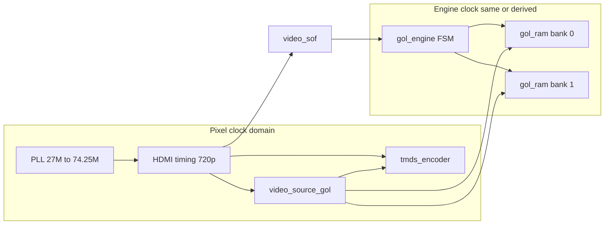

# Game of Life on Tang Nano 20K — Implementation Plan

## Current state

- **Workspace**: Empty. No `src/`, no Verilog, no `DEV_GUIDE.md`. The brief (and the specstory copy) is the only specification.
- **DEV_GUIDE.md**: Referenced in the brief but not present. The plan assumes creating a short `DEV_GUIDE.md` that captures the stated pitfalls (RAM in separate modules, 1-cycle read latency, swap on SOF only, no large arrays in FSM) so they are in-repo.

---

## Segments and TDD-style verification

Work in **segments**. For each segment: define **pass criteria** (tests/synthesis), then implement until those criteria pass. Do not move to the next segment until the current one is verified.

| Segment              | Deliverables                                                                      | Verification (confirm before continuing)                                                                                                                                                                                           |
| -------------------- | --------------------------------------------------------------------------------- | ---------------------------------------------------------------------------------------------------------------------------------------------------------------------------------------------------------------------------------- |
| **1 — RAM**          | `DEV_GUIDE.md`, `src/gol_ram.v`, minimal top that instantiates 2× RAM             | **Sim**: testbench writes/reads several addresses; assert 1-cycle read latency and correct data. **Synth**: resource report shows BRAM/BSRAM for 2× 64K×4; no large DFF in RAM.                                                    |
| **2 — Engine**       | `src/gol_engine.v`, testbench, top with 2× RAM + engine                           | **Sim**: reset → init writes both banks; feed fixed SOF; run a few cells and check one known cell (e.g. center of R-pentomino) updates correctly; assert buffer swap only on SOF. **Synth**: DFF count reasonable; no BRAM in FSM. |
| **3 — Video + HDMI** | `tmds_encoder.v`, `svo_hdmi.v`, `video_source_gol.v`; optional small tops or sims | **Sim** (where useful): timing counts (720p), pixel→grid mapping, color LUT. **Synth**: each sub-block or combined video path builds; no inference surprises.                                                                      |
| **4 — Integration**  | `src/top.v`, `constraints.cst`, full pipeline                                     | **Synth**: full build, timing closure at 74.25 MHz. **On-board**: HDMI output shows grid and running GoL (or test pattern if engine not yet hooked).                                                                               |

**Testbench location**: `sim/` or `tb/` (e.g. `tb_gol_ram.v`, `tb_gol_engine.v`). Run with Icarus Verilog, Verilator, or Gowin simulator; add a short note in DEV_GUIDE or README on how to run sims.

---

## Architecture (high level)

- **Double buffer**: `ram_select` chooses which bank is **display** (read by video) vs **update** (written by engine). Swap only on `video_sof`; engine never writes to the display bank.
- **Address**: 16-bit `addr = {y[7:0], x[7:0]}`; toroidal wrap via 8-bit arithmetic (e.g. `x-1` when x=0 gives 255).

---

## 1. Project layout and docs

- Create `src/` and the six Verilog files plus `constraints.cst` at repo root.
- Add **DEV_GUIDE.md** (root or `docs/`) summarizing: (1) Grid RAM only in `gol_ram.v`, `reg [3:0] mem [0:65535]` for BRAM inference; (2) 1-cycle read latency — FSM must pipeline (address cycle N, use data at N+1); (3) Buffer swap only on `video_sof`; (4) No large arrays in the FSM module; (5) Build order and “synthesize after each module” check.

---

## 2. `gol_ram.v` — Grid RAM module

- **Interface**: Single synchronous port: `clk`, `addr [15:0]`, `we`, `din [3:0]`, `dout [3:0]`.
- **Implementation**: `reg [3:0] mem [0:65535]`; on posedge `clk`: if `we` then `mem[addr] <= din`; assign `dout = mem[addr]` (or register `dout` one cycle later for explicit 1-cycle read latency — ensure same pattern is used consistently so engine and video align).
- **Inference**: Use a single read/write port, synchronous write, synchronous read (registered output) so Gowin infers BRAM (B-SRAM). No logic in the RAM module beyond address/data/we; keep it a pure memory module.
- **Usage**: Top level instantiates **two** instances (bank0, bank1). Engine and video will each drive/read the appropriate bank via a shared address/data interface or separate ports; see top-level wiring below.

---

## 3. `gol_engine.v` — Update FSM

- **Clocking**: One clock (e.g. same as pixel clock or a divided clock); `video_sof` is the only sync to swap buffers.
- **I/O**: 
  - Inputs: `clk`, `rst`, `video_sof`.
  - Outputs: `ram_select` (which bank is display: 0 or 1), `addr [15:0]`, `we`, `din [3:0]` to **both** RAMs; each RAM’s `addr`/`we`/`din` is driven only when that bank is the **destination** (write) bank; read address is shared.
  - RAM read data: two inputs `dout_bank0`, `dout_bank1`; FSM uses the one from the **source** (read) bank for current cell and neighbors.
- **States** (per cell):
  1. **READ_CENTER**: Set read address to current cell `{y,x}`; request center cell from source bank. No decision on this cycle (latency).
  2. **READ_NEIGHBORS** (8 cycles): Pipeline — cycle N: present neighbor address; cycle N+1: add `dout != 0` to `any_alive_count`, and optionally same-species count. Optional **early exit**: if `any_alive_count >= 4` during accumulation, skip remaining neighbor reads and go to APPLY_RULES (cell will die).
  3. **APPLY_RULES**: Use registered center value and final neighbor counts. Conway: alive + (2 or 3) → survive (keep species); dead + exactly 3 → birth (majority species of the 3, or fixed tiebreak); else → 0. Optional **skip write**: if new state equals old center, omit write to dest bank.
  4. **ADVANCE**: Increment cell index (e.g. 16-bit counter for 0..65535). If done (e.g. 65535), then idle until next `video_sof`; on `video_sof` flip `ram_select` and start next frame from cell 0.
- **Pipelining**: Never use “this cycle’s” read data for “this cycle’s” write or state transition. Read at N, use result at N+1; center read in READ_CENTER is consumed in APPLY_RULES; neighbor reads are consumed one cycle after the address is applied.
- **Toroidal neighbors**: For cell (x,y), 8 neighbors at (x±1, y±1) with 8-bit wrap: e.g. `x_next = x + 1`, `x_prev = x - 1` (no extra logic; Verilog 8-bit arithmetic wraps).
- **Init**: Add an **INIT** state (or multi-cycle init): write seed into **both** banks (same addresses) so after first swap both banks are valid. Seed: e.g. LFSR-based random at ~25% density, or fixed pattern (R-pentomino, acorn). Init runs once after reset; then run the main FSM.

---

## 4. `video_source_gol.v` — Pixel to grid and colors

- **Inputs**: Pixel coordinates (from timing), `ram_select`, and **read-only** access to the **display** bank (address in, data out with 1-cycle latency).
- **Layout (720p)**: e.g. 1280×720. Grid 256×256 cells at 2×2 pixels each = 512×512 pixels. Center the grid: e.g. `GRID_OFFSET_X = (1280 - 512)/2`, `GRID_OFFSET_Y = (720 - 512)/2` (or similar); top/bottom bars for the rest.
- **Mapping**: In grid area: `gol_x = (pixel_x - GRID_OFFSET_X) >> 1`, `gol_y = (pixel_y - GRID_OFFSET_Y) >> 1`. Address to display bank: `addr = {gol_y[7:0], gol_x[7:0]}`. Pipeline: present address one cycle before using species for color.
- **Color**: 8-entry LUT: index 0 = black (dead); indices 1–7 = distinct RGB for species 1–7. Output RGB (e.g. 8b per channel or whatever `tmds_encoder` expects). Out-of-bounds (bars) → black.
- **Timing**: Output valid during active video; sync with HDMI timing (de/active signals from `svo_hdmi`).

---

## 5. TMDS and HDMI

- **tmds_encoder.v**: 8b/10b TMDS for one channel (or three instances for R, G, B). Input: 8-bit data, control bits, clk; output: 10-bit encoded serial (or parallel 10-bit if next stage serializes). Can follow open-source TMDS (e.g. from sipeed examples or common FPGA HDMI tutorials).
- **svo_hdmi.v** (or equivalent):
  - **Timing**: 720p (1280×720 @ 60 Hz): h_active=1280, h_sync, h_front/back porch; v_* similarly. Pixel clock 74.25 MHz from PLL.
  - **Outputs**: `hsync`, `vsync`, `de` (data enable), `pixel_x`, `pixel_y`, `video_sof` (one pulse at start of each frame).
  - **video_sof**: Assert for one pixel clock at the beginning of each frame; used by `gol_engine` to swap buffers and start the next generation.
  - **Data path**: Combines timing + `video_source_gol` RGB → three TMDS encoders → serializers. On Tang Nano 20K, HDMI output uses the onboard connector; drive differential outputs (e.g. OSER10 + ELVDS or vendor primitives) as per Gowin/sipeed reference.
- **Reference**: Use [sipeed/TangNano-20K-example](https://github.com/sipeed/TangNano-20K-example) (e.g. `hdmi` folder) for: 720p timing constants, HDMI pin assignments, and PLL (27 MHz → 74.25 MHz). Reuse or adapt their constraint names and pin list in `constraints.cst`.

---

## 6. Top and constraints

- **top.v**:
  - **PLL**: Input 27 MHz from crystal; output 74.25 MHz for pixel/HDMI (and optionally same or divided for `gol_engine`).
  - **Instances**: 2× `gol_ram` (bank0, bank1); 1× `gol_engine`; 1× `video_source_gol`; 1× `svo_hdmi` (or equivalent); 3× `tmds_encoder` (or one module that instantiates three).
  - **Wiring**: 
    - Engine: selects read bank by `ram_select`, writes only to the other bank; provides read address for current bank and receives `dout` from that bank; write port (addr, we, din) only to the destination bank.
    - Video: receives `ram_select`, generates read address from pixel, reads from the **display** bank (same `ram_select` as “which bank display reads”), 1-cycle latency for `dout` into color LUT.
  - **Pin assignments**: HDMI data and clock pins, 27 MHz clock input; from Sipeed schematic or example `constraints.cst`.
- **constraints.cst**: Pin locations and I/O standards for GW2A-LV18PG256C8/I7: clock, HDMI (TMDS data + clock), any LEDs if desired. Copy/adapt from TangNano-20K-example.

---

## 7. Build order and verification

Follow the **Segments and TDD-style verification** table above. In short:

1. **Segment 1**: DEV_GUIDE + gol_ram + testbench → sim (write/read, 1-cycle latency) + synth (BRAM, no DFF bloat).
2. **Segment 2**: gol_engine + testbench + top with 2× RAM → sim (init, one-cell update, SOF swap) + synth (DFF count, no BRAM in FSM).
3. **Segment 3**: tmds_encoder, svo_hdmi, video_source_gol → sim where useful (timing, mapping, LUT) + synth per block.
4. **Segment 4**: top.v + constraints.cst → full synth, timing closure, on-board HDMI check.

Init/seed is verified in Segment 2 (sim) and Segment 4 (on-board).

---

## 8. Species and majority rule (detail)

- Store cell state as 4 bits: 0 = dead, 1–7 = species.
- **Birth** (center dead, exactly 3 neighbors): need majority among the 3 neighbor species. Options: (a) store the three species in the 8-neighbor read pipeline and compute majority in APPLY_RULES (e.g. compare and vote); (b) or simpler tiebreak: e.g. max of the three, or first-seen. Brief says “majority species among those 3 (or any tiebreak)” — implement majority if FSM budget allows, else a deterministic tiebreak.
- **Survival**: 2 or 3 neighbors → keep current species (registered center value).
- **Death**: else → write 0.

---

## 9. Files to create (summary)

| Path                                             | Purpose                                                                                 |
| ------------------------------------------------ | --------------------------------------------------------------------------------------- |
| [DEV_GUIDE.md](DEV_GUIDE.md)                     | Pitfalls; build order; how to run sims.                                                 |
| [src/gol_ram.v](src/gol_ram.v)                   | Single-port sync 64K×4 RAM; BRAM inference.                                             |
| [sim/tb_gol_ram.v](sim/tb_gol_ram.v)             | Testbench: write/read, 1-cycle latency (Segment 1).                                     |
| [src/gol_engine.v](src/gol_engine.v)             | FSM: INIT, READ_CENTER, READ_NEIGHBORS (8), APPLY_RULES, ADVANCE; double-buffer on SOF. |
| [sim/tb_gol_engine.v](sim/tb_gol_engine.v)       | Testbench: init, one-cell update, SOF swap (Segment 2).                                 |
| [src/video_source_gol.v](src/video_source_gol.v) | Pixel→grid, 2×2 scaling, 8-color LUT, display-bank read.                                |
| [src/tmds_encoder.v](src/tmds_encoder.v)         | 8b/10b TMDS per channel.                                                                |
| [src/svo_hdmi.v](src/svo_hdmi.v)                 | 720p timing, video_sof, pixel coords, TMDS + serialization.                             |
| [src/top.v](src/top.v)                           | PLL, 2× gol_ram, gol_engine, video_source_gol, svo_hdmi, pin wiring.                    |
| [constraints.cst](constraints.cst)               | Tang Nano 20K pins (clock, HDMI); from Sipeed example.                                  |

No existing code to modify; all files are new. **Do each segment fully (implement + verify) before moving on** so simulation and synthesis confirm what is working at each step.